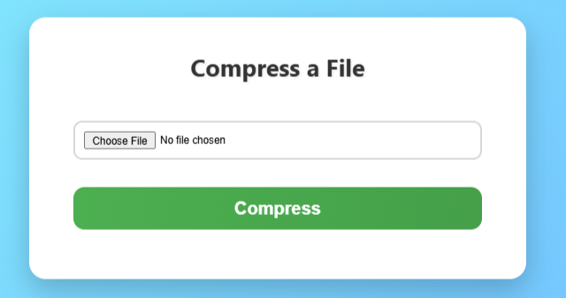
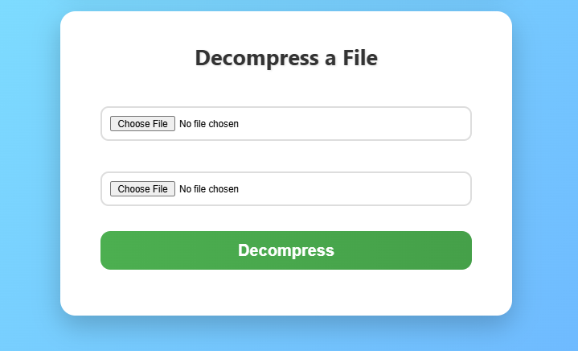

# 🌟 Zipp Huff

 
 


**Zipp Huff** is a **lightweight, browser-based utility** for **Huffman coding-based file compression and decompression**.  
Everything runs **client-side**, keeping your data private.  
No uploads, no servers — just your browser 🚀.

---

## 🚀 Features

- 📦 **Compress files using Huffman coding**  
- 🔓 **Decompress using a secure key file**  
- 🧠 **100% client-side & privacy-safe**  
- 📁 **Supports any file type** (Text, images, binaries, etc.)  
- 🖥️ **No installation required** — just open `index.html`  

---

## 🛠️ Technologies Used

| Technology | Purpose |
|------------|---------|
| HTML5      | Structure & UI |
| CSS3       | Styling & layout |
| JavaScript | Huffman compression/decompression logic |

---

## 📂 Project Structure

```plaintext
ZippHuff/
│
├── index.html        # Main web interface
├── style.css         # Stylesheet for the UI
├── script.js         # Core logic for Huffman compression/decompression
├── screenshots/      # Folder for screenshots
│   ├── compress.png
│   └── decompress.png
└── README.md         # Project documentation
```

---

## 💾 Compress File

Select a file and click **Compress** to generate:  
- `.huff` — compressed file.  
- `.key` — Huffman tree key for decoding.

---

## 🔄 Decompress File

Upload the `.huff` file and `.key` file to restore the original file.

---

### ✅ Compress a File
<div style="display: flex; align-items: center; justify-content: space-between; margin-bottom: 2em;">

  <div style="flex: 1; padding-right: 1em;">
    1. Open <strong>index.html</strong> in your browser.<br>
    2. Navigate to the <strong>Compress a File</strong> section.<br>
    3. Click <strong>Choose File</strong> and select your file.<br>
    4. Click <strong>Compress</strong>.<br>
    5. Download <code>.huff</code> and <code>.key</code> files.
  </div>

  <div style="flex: 1; text-align:center;">
    
  </div>

</div>

<hr>

<h3>🔓 Decompress a File</h3>

<div style="display: flex; align-items: center; justify-content: space-between; margin-top: 1em;">

  <div style="flex: 1; padding-right: 1em;">
    1. Scroll to the <strong>Decompress a File</strong> section.<br>
    2. Upload the <code>.huff</code> and corresponding <code>.key</code> file.<br>
    3. Click <strong>Decompress</strong>.<br>
    4. Download the restored original file.
  </div>

  <div style="flex: 1; text-align:center;">
    
  </div>

</div>


---

## 🧪 How Huffman Coding Works

Huffman coding is a lossless compression algorithm that assigns shorter codes to frequent characters.

### 🔹 Steps

- Frequency Analysis: Counts each character’s frequency.  
- Build Priority Queue: Nodes ordered by frequency.  
- Build Huffman Tree: Merge lowest-frequency nodes iteratively.  
- Assign Binary Codes: Left edge = 0, right edge = 1.  
- Encode File: Replace characters with codes.  
- Store Tree: Save codes in `.key` file for decompression.

---

## 📊 Example Table

| Character | Frequency | Code |
|-----------|-----------|------|
| A         | 5         | 0    |
| B         | 2         | 10   |
| C         | 1         | 110  |
| D         | 1         | 111  |

_Example Encoding:_  
`ABCD` → `010110111` (compressed binary)

---

## 📋 Important Notes

- ⚠️ The `.key` file is essential — without it, `.huff` cannot be decompressed.  
- 💾 Compression is lossless, so no data is lost.  
- 🌐 All processing happens client-side; no files are uploaded.

